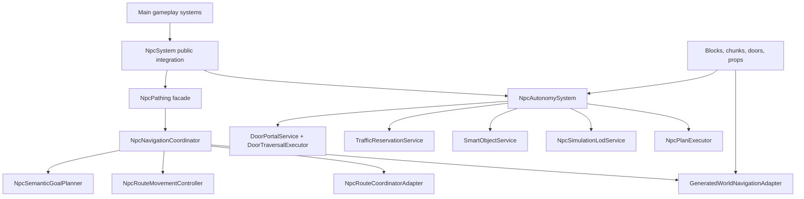

# NPC Pathfinding Architecture

This document describes the Phase 13 NPC autonomy, navigation, door, traffic, and movement stack. It replaces the earlier migration-era description that still referenced the legacy mover as the active runtime path.

## Runtime Ownership

`NpcSystem.gd` remains the public gameplay integration point. It owns NPC registration, save-facing dictionaries, spawn/load placement, public stat adapters, tutorial/story/combat hooks, and the public methods used by tests and gameplay systems.

The composed runtime stack under `scripts/npc_ai/` owns NPC decisions and traversal:

- `NpcAutonomySystem.gd`: service root for contexts, blackboards, telemetry, navigation events, doors, smart objects, traffic, schedules, and lifecycle cleanup.
- `GeneratedWorldNavigationAdapter.gd`: event-driven generated-world topology adapter. It consumes navigation change events and rebuilds affected topology snapshots; it does not scan the scene tree to infer a revision every frame.
- `NpcRouteCoordinatorAdapter.gd` and `HierarchicalRoutePlanner.gd`: deterministic route coordination, semantic costs, route repair, and explicit traversal actions.
- `NpcRouteMovementController.gd`: route-following controller for `CharacterBody3D` NPCs. Normal route movement is applied through the shared character motor and Godot collision movement.
- `NpcSemanticGoalPlanner.gd`, `NpcPlanExecutor.gd`, and behavior services: role, schedule, hunger, threat, work, guard, and scripted intent selection and execution.
- `DoorPortalService.gd`, `DoorController.gd`, and `DoorTraversalExecutor.gd`: shared player/NPC door authority, logical portals, holds, queues, active crossings, and safe close policy.
- `TrafficReservationService.gd`: space-time node, edge, portal, bridge, and interaction-slot reservations with deterministic priority, aging, pending replans, and explicit cleanup.
- `SmartObjectService.gd`: shared resource and utility-object availability, capacity, reservations, and completion.
- `NpcSimulationLodService.gd`: active/abstract transitions with safe placement on promotion and route/reservation cleanup on demotion/removal.

`NpcPathing.gd` is a thin public facade over `NpcNavigationCoordinator.gd` for older callers. It no longer owns topology, route search, movement, doors, or goal behavior.

## Movement Contract

Active NPC bodies are `CharacterBody3D` agents. Route progress is based on post-physics body position. Normal route movement does not write `position`, `global_position`, `transform`, or `global_transform`.

Direct placement is limited to named safe-placement paths:

- spawn and registration placement;
- save/load restoration;
- abstract/active LOD promotion;
- explicit test or administrator setup.

Those paths validate the capsule through the safe-placement service and do not count as route progress.

## Navigation And Routing

Navigation topology is built from generated terrain, structures, interiors, doors, roads, work/resource approaches, guard posts, semantic areas, and dynamic blockers. Topology revisions are driven by events:

- block create/remove;
- chunk load/unload;
- door state and portal changes;
- dynamic obstacle and smart-object premise changes.

Route requests use explicit terminal states. `PARTIAL` is never silently accepted as arrival. Door traversal is represented as an action on the route and survives smoothing. Dynamic changes invalidate or repair only affected route segments when possible.

## Doors And Traffic

Doors are controlled by desired-state requests: open, hold, release, close, lock, unlock, destroy, or cancel. NPCs do not call blind toggles.

Every doorway is represented by a logical portal. Double doors share one portal. A door crossing acquires a traffic reservation before opening/holding the portal. Active crossing ownership is per actor and portal, so one actor cannot overwrite another actor's crossing state. Pending groups are replanned when re-requested after blockers release, and granted active crossings survive route-generation replacement until the door release path clears them.

Door close policy checks threshold, sweep, and clearance volumes against current actors. Timers only schedule attempts; they never override occupancy or active crossing safety.

## Purpose And Schedules

NPC decisions are selected from role, schedule, hunger, threats, orders, work facts, home/interior facts, and reachable world anchors. Ordinary movement targets semantic anchors, not raw random world coordinates.

Night behavior is explicit:

- assigned guards may remain outside at a guard post, patrol, or threat intercept;
- non-duty NPCs return through real entrances into assigned interiors;
- porch, threshold, exterior edge, or roof positions do not count as inside;
- threat, rescue, evacuation, script, or unreachable-home exceptions must be explicit goals/reasons.

`canFight` remains a combat capability field. It is not guard duty.

## Save Boundary

Saves persist durable identity, profile, inventory, home/job facts, schedule-reconstructable intent, and compatible public dictionary fields. Runtime queues, route cells/actions, traffic reservations, avoidance state, planner queues, telemetry rings, and RVO state are filtered from save snapshots.

Old saves load with missing NPC fields defaulted. New saves round-trip durable state only.

## Extension Rules

New movement capabilities should add typed traversal actions or edges. New doors and gates register logical portals. New smart objects register slots and effects through `SmartObjectService`. New roles add utility/schedule/action preferences instead of direct movement loops. New dynamic construction must emit navigation change events.

Every extension needs focused tests in the matching suite and day/night coverage when schedule behavior is affected.
