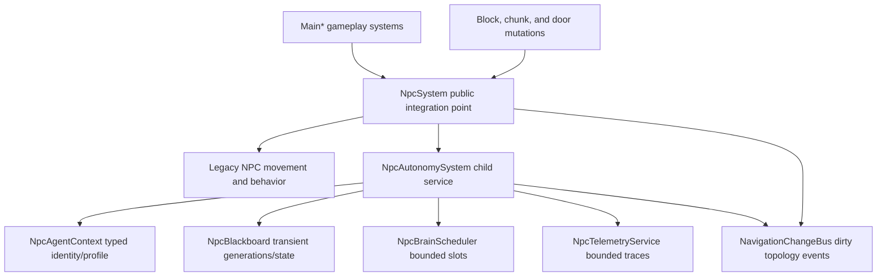

# NPC Pathfinding Architecture

Phase 01 establishes the typed contracts and observability boundary for the NPC replacement. It does not move NPCs through the new stack yet. Legacy movement, jobs, combat, and door behavior remain active through `NpcSystem.gd` and `NpcPathing.gd`.

## Ownership

`NpcSystem.gd` remains the public integration point used by tutorial, story, combat, HUD, playtests, and world systems during migration. It owns the legacy NPC entry dictionaries and keeps save-facing state compatible.

`NpcAutonomySystem.gd` is a composed child of `NpcSystem.gd`. It owns new runtime-only state:

- `NpcAgentContext`: stable NPC identity, role/profile data, traversal profile, guard duty, deterministic RNG streams, and weak body reference.
- `NpcBlackboard`: transient decision state, route/action generations, current terminal state, reservations, blockers, and bounded progress history.
- `NpcBrainScheduler`: deterministic staggered high-level update slots.
- `NpcTelemetryService`: bounded structured events and counters.
- `NavigationChangeBus`: bounded authoritative dirty events for future topology consumers.

Save snapshots remain dictionary-based at the persistence boundary. `agentContext`, `blackboard`, telemetry, scheduler state, and change-bus queues are runtime-only and are not written into save data.



## Event Flow

World mutation points send adapter events to `NpcSystem`, which forwards them to `NpcAutonomySystem`. The legacy navigation consumer still runs unchanged.

- `MainChunkTerrain.create_block()` emits `block_created` with the exact `Vector3i` cell, block type, bounds, and tile key.
- `MainChunkTerrain.collapse_structure_component()` emits `block_removed` before erasing the block.
- `MainPropFactory.complete_destroy_target()` emits `block_removed` before erasing a player-destroyed block.
- `MainRuntimeTools.create_chunk()` emits `chunk_loaded` after registering the chunk.
- `MainRuntimeTools.update_chunks()` and `rebuild_chunk()` emit `chunk_unloaded` before erasing a chunk.
- `MainRuntimeTools.toggle_door()` emits `door_state` after applying the legacy open/closed state.

`NavigationChangeBus` increments a monotonic revision on every emitted change. Changes are coalesced by tile key until `flush_frame()`. A flushed event carries:

- `tileKey`
- `revision`
- `changeKinds`
- `objectIds`
- merged `bounds`
- optional `sourceRevisions`
- `coalescedCount`

The contract is event-driven. Consumers should use event bounds and tile keys instead of scanning the scene tree to infer revisions.

## Bounds

All Phase 01 runtime observability structures have explicit limits.

| Structure | Owner | Bound |
| --- | --- | --- |
| Per-NPC telemetry ring | `NpcTelemetryService` | `NpcConstants.TELEMETRY_RING_CAPACITY` = 256 |
| Global telemetry counters | `NpcTelemetryService` | `NpcConstants.TELEMETRY_GLOBAL_COUNTER_LIMIT` = 128 |
| Registered brain agents | `NpcBrainScheduler` | `NpcConstants.BRAIN_REGISTERED_AGENT_LIMIT` = 256 |
| Brain updates per tick | `NpcBrainScheduler` | `NpcConstants.BRAIN_UPDATES_PER_TICK` = 8 |
| Pending changed tiles | `NavigationChangeBus` | `NpcConstants.CHANGE_BUS_MAX_PENDING_TILES` = 512 |
| Blackboard distance history | `NpcBlackboard.remember_distance()` | Caller supplied limit, default 16 |

Overflow behavior is deterministic: telemetry evicts oldest events per actor, scheduler rejects registrations over the bound and counts denials, and the change bus drops excess new tile buckets while counting dropped events.

## Contracts

Route terminal states are explicit:

- `complete`
- `partial`
- `unreachable`
- `invalidated`
- `cancelled`
- `failed_internal`

`pending` and `searching` are not terminal. A `partial` route is terminal but never satisfies arrival. Arrival checks require `complete` plus an arrival contract when the caller expects one.

Route requests, blackboards, and action instances carry generations. Stale generations cannot cancel current requests or mutate current route/action terminal state.

Stable ordering uses string stable IDs, not instance IDs or dictionary iteration order. Per-NPC randomness is generated from world seed, stable NPC ID, domain, and phase so it does not consume or reorder world-generation RNG.

Guard duty is represented as `guard_duty_kind` and is separate from legacy `canFight`. Phase 01 records the distinction but does not migrate day/night behavior yet.

## Migration Switch

Current architecture version:

```text
phase01_contracts_observability
```

Current locomotion mode:

```text
legacy_static_body_adapter
```

The switch is runtime-only and only reports telemetry/state. Production still uses the legacy `StaticBody3D` movement path. No actor runs two locomotion stacks in Phase 01.
